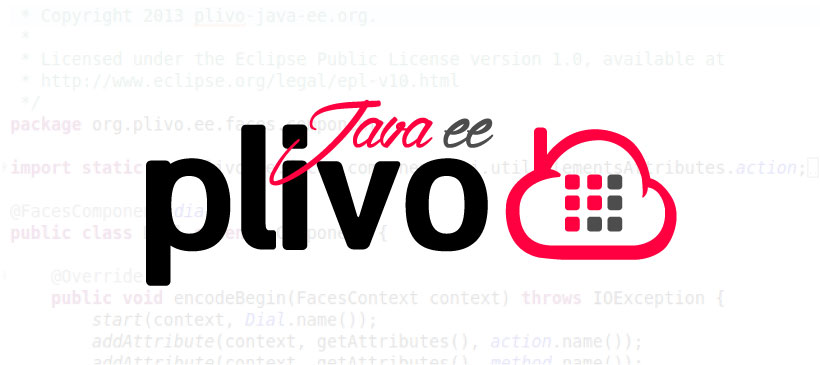

plivo-java-ee
=============



The purpose of this library is <b>simplify</b> the use of <a href="http://www.plivo.com/">Plivo</a> services in java enterprise application servers.
The library is usefull on various aspects:

- to generate Plivo XML (using java server faces)
- to read the Plivo Request Parameters (using java CDI)
- to call or to send messages using @Inject  @Request scoped java beans
- to tracking the calls using special java scope @CallScope (like @SessionScoped)

<b>You should know the difference between java SE and java EE</b>:

- Java SE (formerly J2SE) is the basic Java environment (you only need a JVM to use Java SE).
- <b>Java EE is the enterprise edition of Java</b>. With it, you make websites, large scale applications, using more advanced api and more powerful services integrated in the platform. Besides the JVM, you need an application server Java EE-compatible, like Oracle GlassFish, Red Hat JBoss 6,7.x, Red Hat WildFly 8, IBM WebSphere, Apache Geronimo, Apache Tomee and others.

In your maven project you should have:

```
<dependency>
	<groupId>javax</groupId>
	<artifactId>javaee-api</artifactId>
	<version>${javaee-api.version}</version>
	<scope>provided</scope>
</dependency>

<dependency>
	<groupId>com.plivo</groupId>
	<artifactId>plivo-java</artifactId>
	<version>${plivo-java.version}</version>
	<scope>compile</scope>
</dependency>
```


<h2>Generate <a href="http://plivo.com/docs/xml/">Plivo XML</a> using JavaServer Faces</h2>
<a href="http://htmlpreview.github.io/?https://raw.github.com/plivo-java-ee/plivo-java-ee/master/docs/vdldoc/index.html">If you want know all jsf tags, you should consult the vdldoc page</a>

<b>Using PLIVO JAVA HELPER LIBRARY</b>

You can generate xml code using the official library and you can publish the output generated using java Servlet.

```

@WebServlet(description = "A simple Sample", urlPatterns = { "/servletsample" })
public class ServletSample extends HttpServlet {

	private static final long serialVersionUID = 1L;

	protected void service(HttpServletRequest request,
			HttpServletResponse response) throws ServletException, IOException {
		PlivoResponse plivoResponse = new PlivoResponse();
		Dial dial = new Dial();
		dial.setCallerId("12345678901");
		Number number = new Number("12345678901");

		dial.setAction("http://http://plivo-java-ee.org/redirect");
		dial.setMethod("GET");

		try {
			dial.append(number);
			plivoResponse.append(dial);
			response.setContentType("application/xml");
			response.getWriter().print(plivoResponse.toXML());
		} catch (PlivoException e) {
			System.out.println(e.getLocalizedMessage());
		}
	}
}

```

This is simple and also very performant, but if you want change something, <b>you must recompile and redeploy your servlet</b>.


<b>USING PLIVO JAVA EE</b>

You can create a simple page page.xhtml and you can use plivo-java-ee tags.


```

<?xml version="1.0" encoding="UTF-8"?>
<f:view xmlns="http://www.w3c.org/1999/xhtml"
	xmlns:f="http://java.sun.com/jsf/core"
	xmlns:pj="http://plivo-java-ee.org/plivo-java-ee">
	<pj:response>
		<pj:dial callerId="12345678901" 
			action="http://http://plivo-java-ee.org/redirect" 
			method="GET">
			<pj:number>12345678901</pj:number>
		</pj:dial>
	</pj:response>
</f:view>

```

<b>This is more simple, and if you want change something, you mustn't recompile anything.</b>

<h2>@Inject <a href="http://plivo.com/docs/xml/request/">Plivo Request Parameters</a> with java CDI</h2>

Work in progress! 

<h2>Call or Send messages using CDI @Inject</h2>

Work in progress! 

<h2> Special java scope @CallScope (like @SessionScoped)</h2>

Work in progress! 

<h2>More informations</h2>

For more informations <a href="http://www.plivo-java-ee.org/">plivo-java-ee.org</a> or send an email to fiorenzino[AT]gmail.com

<a href="http://www.plivo.com/">Plivo is a trademark of Plivo Inc.</a>
